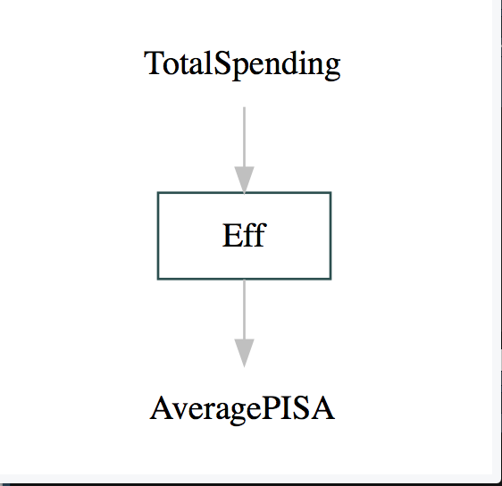
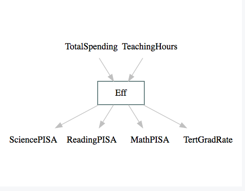

```{r setup, warning=FALSE, include=FALSE}
knitr::opts_chunk$set(echo = FALSE)
# this sets the default code chunk to run silently. 
# Use echo = TRUE to show code

# Be sure the latest version of the following packages are instialled
library(tidyverse, quietly = TRUE)
library(ROI, quietly = TRUE)
library(ROI.plugin.glpk, quietly = TRUE)
library(ompr, quietly = TRUE)
library(ompr.roi, quietly = TRUE)
library(pander, quietly = TRUE)
library(Benchmarking, quietly = TRUE)
library(rDEA, quietly = TRUE)
library(knitr)
library(kableExtra)
library(DiagrammeR)
library(MultiplierDEA)
library(ggthemes)
library(corrplot)

#
options(digits = 3, scipen = 999)

set.seed(123)
```

# Abstract

The paper aims to study the efficiency of education systems in Organization for Economic Development (OECD) countries. We examine efficiency by looking at the relationship between defined inputs and outputs. Data Envelopment Analysis (DEA), which is a widely used tool for measuring efficiency, was conducted to measure the efficiency of the education system of the countries. 

This project is available on GitHub: https://github.com/AndeyNunes/educationDEA

# Introduction

In the last few decades, Benchmarking, a non-parametric evaluation approach, has found applications in a variety of fields. The technique has equipped organizations with the means to evaluate their processes and compare it to the best practice of peer organizations. This has allowed them to gauge their own performance and enable them to learn and develop plans to improve aspects of their own performance and set future targets [9]. 

In the education sector, studies utilizing benchmarking techniques are numerous and vary widely in focus. The richness of the data collected on education far exceeds that which have been thoroughly studied and published. This makes comparative studies on education data an interesting endeavor as it could reveal interesting patterns and discussion points.

In this paper, our aim is to study the efficiency of the education systems of 25 countries from the Organization for Economic Development (OECD) using DEA technique. We have several motivations for working with OECD countries. All OECD countries dedicate a percentage of their Gross Domestic Product (GDP) to education spending and all participate in the Programme for International Student Assement (PISA), a global educational assessment system. The OECD collects and publicly publishes data on several aspects relating to education such as public spending, enrollment, and graduation rates. And finally, this data is considered reliable as both PISA and OECD are independently run organizations with a track record of professionalism and trustworthy in reporting accurate data. 


**Benchmarking with Data Envelopment Analysis (DEA)** 

Data Envelopment Analysis (DEA) is just one of a few benchmarking techniques currently in use including stochastic frontier analyis (SFA). DEA is a widely used benchmarking technique that was first proposed by Charnes, Cooper, and Rhodes in 1978. The technique is a nonparametric linear programming method that compares relative efficiencies of Decision Making Units (DMUs) and provides a comprehensive measure of each DMU’s performance.  In a DEA analysis, efficiency is usually given as the weighted sum of outputs dividied by the weighted sum of the input resources [2,3,6]. 

$$
\text{Efficiency} = \text{Weighted} \sum \frac{outputs}{inputs}
$$

DEA models can be categorized as either input oriented or output oriented. Input-oriented models minimize inputs while satisfying at least the given output levels, while output oriented models maximize outputs without requiring more of any observed input values [7]. 

DEA models can also be categorized according to the weight constraints. In this case, Models are subdivided into four categories. Contant returns to scale $CRS$, where the CCR model is built upon and has no constraints. Variable returns to scale $VRS$ where the sum of all lambda is set to 1. Increasing returns to scale $IRS$ where is the sum is set to greater than 1 and  Decreasing returns to scale $DRS$ having the sum being less than 1 [2]. 

Returns to Scale | Envelopment Constraint
-----------------|---------------------
CRS    | No constraint needed
VRS    | $\sum_{j=1}^{N^D} \lambda_j  = 1$
IRS    | $\sum_{j=1}^{N^D} \lambda_j  \geq 1$
DRS    | $\sum_{j=1}^{N^D} \lambda_j  \leq 1$


In this paper, we specify an output oriented variable returns to scale model to look at the efficiences of the 25 OECD countries in terms of public education resources as the inputs and graduation rates along with the PISA test score as our outputs. Our objectives is to compare different countries resource use against the academic achievements of students.  

# Literature Review

Data Envelopment Analysis has been used to evaluate educational efficiencies in OECD countries. [5]

There are several papers using DEA in education in the google drive. Lets just mention them here. This can just be a paragraph that shows that we looked at the topic. Or we can delete the heading in line 76  and incorporate some of this into the intro or methodology.


# Methodology

Benchmarking using a DEA model involves measuing the relative efficiency of a Decision Making Unit (DMU), which is determined by comparing the studied unit's performance in producing output with a target. [2] In our study, DMUs are the country's education system. The objective here is to find the efficiency of this education system in making educational achievements, measured by the PISA test scores and college graduation rates, using the resources invested in the system, measured in time and money.

For inputs, we considered each country's education spending per student in US dollars and the number of hours teachers spend with students. Per student data will help us to eliminate the size effect of a country with large GDP and thus large budget for education.

As our goal is to evaluate the efficiency of the country's education system, we decided to use PISA score as measumement of success. PISA is widely recognized performance yardstick to assess the competency of a country's school system. PISA focus on three segment: reading, mathematic and science. 

Our project looks first at a single input of Total Spending per student and single output of average PISA score. We then expand on the model by including additional input of Total Hours teachers spend along with the more granualar PISA scores and an additional output, tertiary graduation rate, for a multiple input - multiple output model.

In each case, our DEA model is based on output-orientation because the focus of the model is on improving and optimizing the output based on the input as observed in studied units. We assumed that each country has a given fund for spending on education which is influened by various factors including the GDP, education budgets, and political factors.

The basic DEA model is based on an assumption of constant returns to scale. This means that efficient output with a given input can be scaled up or down in a linear or constant rate. Anderson describes this as exhibiting no limit to how big an operation can get with the ratio of input, whereas often in reality, there are structural differnces that inhibit such behavior. [2] The DEA model in our study is based on variable returns to scale (VRS) on the nature of the inputs and outputs. With VRS specified, input can scale up or down, but the output may not scale up or down by the same amount. [3] In fact in the case of test scores, there is an upper limit on the output.

Consider  $n$ number of education system $DMU_j$  which consumes $x_{i,j}$ inputs and produce $y_{r,j}$ output. The education system operates in variable returns to scale. So this output oriented model can be expressed by a linear algebric model where the objective will be to maximize the efficiency scores of _j_ education system. The efficiency scores can be defined by $\phi$


$$
 \begin{split}
 \begin{aligned}
 \text{Max  }   & \phi \\
  \text{subject to }\ & \sum_{j=1}^{n} x_{i,j}\lambda_j \leq x_{i,k} \; \forall \; i \\
                      & \sum_{j=1}^{n} y_{r,j}\lambda_j \geq  \phi_{r,k} \; \forall \; r \\
                      & \lambda_j \geq 0  \; \forall \; j\\
                      & \sum_{j=1}^{n}\lambda_j=1
  \end{aligned}
  \end{split}
$$


Here, a country's education system is considered efficient if the efficeincy score  $\phi$ is 1. The country with score of 1 lies in the efficient frontier which is a linear combination of all the countries with efficiency scores of 1. The countries with scores less than 1 will be considered as relatively inefficient in comparison to the target specified by $\lambda$. The vector $\lambda$ is specific amount of a unit _j_ used in setting the target for performance for studied unit _k_. To accomodate the variable returns to scale of our studied input and output, a constarint that $\lambda$ sums up to 1 is added to the model. Also, as it is a output oriented model, the first (input) constraint will be satisfied while trying to exceed the second constraint (output) by as much possible. 

The discussed methodology has been used to perform two DEA model and analysis for the 25 OECD countries for which we have all the data points. 

```{r load and clean data}
data <- read.csv("OECDdata.csv", stringsAsFactors = F)

data$Total.Spending <- as.numeric(gsub(",", "", data$Total.Spending))

DEAdata <- data %>%
   filter(Total.Spending > 0, # drop 0 spending and NA
          !is.na(Teaching.Hours),
          !is.na(Tertiary.Graduation.Rate)) %>% 
  select(Countries, Total.Spending, AveragePISA, SciencePISA, ReadingPISA, MathematicsPISA, Teaching.Hours, Tertiary.Graduation.Rate)
```

The following OECD countries that were dropped from the analysis due to missing data:

```{r dropped countries}
setdiff(data[,1], DEAdata[,1])
```


Data was obtained from secondary sources. Data on PISA scores and teaching hours were obtained from OECD website. Data on public education spending per student and tertiary graduation rate were obtained from UNESCO website. **Somebody please include the links in the references and then put the numbers in brackets after the sentences here**

Summary of the data and all modeling code chunks in the next several sections are included in the Appendix.


# DEA Model

## Part A: Single input, single output

```{r single IO grViz, eval=F}

#

grViz("
digraph nicegraph {

  # a 'graph' statement
  graph [overlap = true, fontsize = 10]

  # several 'node' statements
  node [shape = rectangle, fixedsize = true, width = 1,
        color = darkslategray]
  Eff

  node [shape = plaintext]
  TotalSpending; AveragePISA

  # 'edge' statements
  edge [color = grey]
  TotalSpending->Eff Eff->AveragePISA 
}
")
```

For this first part, we will set up and solve a DEA model using total educational spending per student for the input and the aggregated PISA test score average for the single output. The input output diagram for this model is included in the Appendix.

```{r single output dea}
# Run a DEA with a single input (total spending) and a single output (Average PISA)
x <- DEAdata %>% select(Total.Spending) # input
y <- DEAdata %>% select(AveragePISA) # output

row.names(x) <- DEAdata$Countries # input labels
row.names(y) <- DEAdata$Countries # output labels

# output oriented model with variable returns to scale
ressingle <- DeaMultiplierModel(x, y, rts = "vrs", orientation = "output") 

```


```{r single output plot}
dea.plot(x = x, y = y, txt = dimnames(x)[[1]], GRID = T,
         xlab = "Total Spending", ylab = "Average PISA", 
         xlim = c(10000,120000),
         ylim = c(400,550), main = "2015 OECD data DEA plot")
```
  
This plot is not formated for easy reading. After examining the `dea.plot()` function from Bogetoft & Otto's Benchmarking package, we were able to emulate the graphic in `ggplot`.
  
```{r single output dea plot}
# warning, the geom_segment calls are not reproducible and must be hand specified
ggplot(DEAdata, aes(x = Total.Spending, y  = AveragePISA)) +
   geom_point() +
   geom_text(aes(label = Countries), size = 3,
             nudge_x = 2, nudge_y = -1.5, color = "gray40") +
   geom_segment(aes(x = 91000, y = 529, xend = 39541, yend = 528.67), color = "dodgerblue") +
   geom_segment(aes(x = 39541, y = 528.67, xend = 22149, yend = 523.67), color = "dodgerblue") +
   geom_segment(aes(x = 22149, y = 523.67, xend = 16691, yend = 458.67), color = "dodgerblue") + 
   geom_segment(aes(x = 16691, y = 458.67, xend = 14173, yend = 415.67), color = "dodgerblue") + 
   geom_segment(aes(x = 14173, y = 415.67, xend = 14173, yend = 400), color = "dodgerblue") + 
   theme_minimal() +
   ggtitle("DEA plot of 2015 OECD Countries",
           subtitle = "Average Education Scores by Total Spending")
# ggsave("single output DEA.png") # uncomment this to update the png file for the presentation
```


## Part B: Multiple Inputs and Outputs

We are also interested in how many hours each country's teachers spend teaching per year as another input, and the tertiary graduation rate as another output. Additionally, we are also using the different science, math, and reading PISA scores that made up the `averagePISA` input from the single input single output model.

```{r multiple IO grViz, eval=F}
#

grViz("
digraph nicegraph {

  # a 'graph' statement
  graph [overlap = true, fontsize = 10]

  # several 'node' statements
  node [shape = rectangle, fixedsize = true, width = 1,
        color = darkslategray]
  Eff

  node [shape = plaintext]
  TotalSpending; TeachingHours; 
  SciencePISA; ReadingPISA; MathPISA; TertGradRate

  # 'edge' statements
  edge [color = grey]
  TotalSpending->Eff TeachingHours->Eff Eff->TertGradRate 
  Eff->SciencePISA Eff->ReadingPISA Eff->MathPISA 
}
")
```

Here is a model with two inputs, total educational spending per student and average teacher hours per year, and four outputs: SciencePISA, ReadingPISA, MathematicsPISA, and tertiary graduation rate.
  
```{r multiple DEA}
# multiple input and multiple output
x <- DEAdata %>% select(Total.Spending, Teaching.Hours) ## input

y <- DEAdata %>% select(SciencePISA, ReadingPISA, MathematicsPISA, Tertiary.Graduation.Rate) ## output

row.names(x) <- DEAdata$Countries # input labels
row.names(y) <- DEAdata$Countries # output labels


resmult <- DeaMultiplierModel(x, y, rts = "vrs", orientation = "output")
```
 
The multiple input multiple output DEA plot is shown here:
 
```{r multiple output plot}
dea.plot(x = x, y = y, txt = dimnames(x)[[1]], GRID = T,
         xlab = "Total Spending + Teaching Hours", 
         ylab = "Multiple Outputs",
         ylim = c(1250,1750), main = "2015 OECD data DEA plot")
```
 
And just to show it more clearly, we recreate the DEA plot using ggplot.

```{r hand drawn multiple output frontier}
# warning, the geom_segment calls are not reproducible and must be hand specified
DEAdata$multIn <- DEAdata$Total.Spending + DEAdata$Teaching.Hours

DEAdata$multOut <- DEAdata$SciencePISA + DEAdata$ReadingPISA + DEAdata$MathematicsPISA + 
  DEAdata$Tertiary.Graduation.Rate


ggplot(DEAdata, aes(x = multIn, y  = multOut)) +
   geom_point() +
   geom_text(aes(label = Countries), size = 3,
             nudge_x = 2, nudge_y = -2, color = "gray40") +
   geom_segment(aes(x = 91000, y = 1681, xend = 40162, yend = 1681), color = "dodgerblue") +
   geom_segment(aes(x = 40162, y = 1681, xend = 22910, yend = 1664), color = "dodgerblue") + 
   geom_segment(aes(x = 22910, y = 1664, xend = 17298, yend = 1470), color = "dodgerblue") +
   geom_segment(aes(x = 17298, y = 1470, xend = 15071, yend = 1304), color = "dodgerblue") + 
   geom_segment(aes(x = 15071, y = 1304, xend = 15071, yend = 1250), color = "dodgerblue") + 
   theme_minimal() +
   labs(xlab = "Total Spending + Teaching Hours", 
        ylab = "SciencePISA + ReadingPISA + MathematicsPISA + Tertiary Graduation Rate") +
   ggtitle("DEA plot of 2015 OECD Countries",
           subtitle = "Multiple Input and Multiple Output")
# ggsave("multiple output DEA.png") # uncomment this to update the png file for the presentation
```

# Results and discussion

## Single input - output results

The average efficiency for the Total Spending yielding Average PISA score is `r mean(ressingle$Efficiency)`.

The table of efficiency and lambda scores indicates the following countries are output-oriented efficient units:
> `r DEAdata$Countries[which(ressingle[[5]]==1)]`

```{r single output efficiency table}
df <- cbind(ressingle$Efficiency, ressingle$Lambda)

tempdf <- df[, colSums(df) != 0]

kable(tempdf, "latex", caption = "Results of Single input-Single output DEA 
      displaying efficiency scores and positive lambda values",
      booktabs = T) %>%
kable_styling(latex_options = "striped", "repeat_header")
# code for kableExtra package from Zhu(2019)
```

Mexico, Greece, Canada, Japan are 100% efficient. Slovakia is the least efficient. Mexico has the highest output weight followed by Turkey. The target of performance for Turkey (w.r.t Mexico) is Mexico scaled down by a factor of 0.0576.

The lambda values of Japan against other countries ranges from 0 to 1. The countries with 0 lambda values (Canada, Chile, Greece, Hungary, Mexico, Turkey lie on or close to the efficiency frotier) cannot be compared with Japan. Austria, Luxembourg, Netherlands, Norway and U.S. have lambda values of 1 meaning the output of these countries cannot be scaled higher than Japan for the same level of input to achieve 100% efficiency. The input values (Spending per student) of these countries are already much higher compared to Japan. 

## Multiple input - output results

The average efficiency for the Total Spending yielding Average PISA score is `r mean(resmult$Efficiency)`.

The table of efficiency and lambda scores indicates the following countries are output-oriented efficient units:
> `r DEAdata$Countries[which(resmult[[5]]==1)]`

```{r multiple IO efficiency table}
df <- cbind(resmult$Efficiency, resmult$Lambda)

tempdf <- df[, colSums(df) != 0]

kable(tempdf, "latex", caption = "Results of Multiple Input Multiple Output DEA 
      displaying efficiency scores and positive lambda values", booktabs = T) %>%
kable_styling(latex_options = c("striped", "scale_down", "repeat_header"))
# code for kableExtra package from Zhu(2019)
```

It seems that with these changed inputs, Canada, Mexico and Japan remain efficient but several other countries, including Turkey, Slovenia, and Poland have become fully efficient, implying that they do a good job utilizing their teacher's hours efficiently. Greece has the highest weight applied to its graduation rate, implying that they do relatively well on this measure.

# References

[1] Anderson, T. R. (2019) Operations Research Using R 

[2] Anderson, T. R. (2019) Data Envelopment Analysis Using R

[3] Bogetoft, P., Otto, L. (2011) Benchmarking with DEA, SFS, and R. Springer. 

[4] Gavurova, B., Kocisova, K., Belas, L., & Krajcik, V. (2017). Relative efficiency of government expenditure on secondary education. Journal of International Studies, 10(2), 329-343. doi:10.14254/2071-8330.2017/10-2/23

[5] Zhu, H. (2019) Create Awesome LaTeX Table with knitr::kable and
kableExtra. https://haozhu233.github.io/kableExtra/awesome_table_in_pdf.pdf 

[6] John D. Lamb, Kai-Hong Tee, Data envelopment analysis models of investment funds,  European Journal of Operational Research, Volume 216, Issue 3, 2012, Pages 687-696

[7]“Data Envelopment Analysis Explained.” Service Productivity Management: Improving Service Performance Using Data Envelopment Analysis (DEA), by H. David. Sherman and Joe Zhu, Springer Science, 2006.
 
[8] data envelopment analysis, YOng bae Ji and Choonjoo Lee

[9]José L. Ruiz, José V. Segura, Inmaculada Sirvent,
Benchmarking and target setting with expert preferences: An application to the evaluation of educational performance of Spanish universities,
European Journal of Operational Research,
Volume 242, Issue 

### Data Sources

Organization for Economic Development https://data.oecd.org/
UNESCO (add URL here)
Teacher hours data source https://data.oecd.org/eduresource/teaching-hours.htm

# Appendix

## Data Summary

```{r data glimpse, echo = T}
glimpse(data)
```

 Let's glance at the teaching hours and the graduation rate:

```{r lookatextravariables,  echo=T}
head(cbind(data$Countries, data$Teaching.Hours, data$Tertiary.Graduation.Rate))
```


## DEA model R code

###  Single input single output

```{r Appendix single output dea, echo=T, eval=F}
# Run a DEA with a single input (total spending) and a single output (Average PISA)
x <- DEAdata %>% select(Total.Spending) # input
y <- DEAdata %>% select(AveragePISA) # output

row.names(x) <- DEAdata$Countries # input labels
row.names(y) <- DEAdata$Countries # output labels

# output oriented model with variable returns to scale
ressingle <- DeaMultiplierModel(x, y, rts = "vrs", orientation = "output") 

```

Table formatting using the `kable_styling()` function from the kableExtra package

```{r Appendix single output efficiency table, echo = T, eval=F}
df <- cbind(ressingle$Efficiency, ressingle$Lambda)

tempdf <- df[, colSums(df) != 0]

kable(tempdf, "latex", caption = "Results of Single input-Single output DEA 
       displaying efficiency scores and positive lambda values",
      booktabs = T) %>%
kable_styling(latex_options = "striped", "repeat_header")
# code for kableExtra package from Zhu(2019)
```

### Multiple input multiple output

```{r Appendix multiple DEA, echo = T, eval=F}
# multiple input and multiple output
x <- DEAdata %>% select(Total.Spending, Teaching.Hours) ## input

y <- DEAdata %>% select(SciencePISA, ReadingPISA, MathematicsPISA, Tertiary.Graduation.Rate) ## output

row.names(x) <- DEAdata$Countries # input labels
row.names(y) <- DEAdata$Countries # output labels


resmult <- DeaMultiplierModel(x, y, rts = "vrs", orientation = "output")
```

Table formatting using the `kable_styling()` function from the kableExtra package

```{r Appendix multiple IO efficiency table, echo = T, eval=F}
df <- cbind(resmult$Efficiency, resmult$Lambda)

tempdf <- df[, colSums(df) != 0]

kable(tempdf, "latex", caption = "Results of Multiple Input Multiple Output DEA 
      displaying efficiency scores and positive lambda values", booktabs = T) %>%
kable_styling(latex_options = c("striped", "scale_down", "repeat_header"))
# code for kableExtra package from Zhu(2019)
```

## Code for DEA Model Graphs

For some reason the DiagrammeR graphs won't render to pdf directly, only to html (then print to pdf). They can be previewed and saved as png in RStudio IDE, which is what we did for this report.

### Single input single output DEA model


It turns out these grViz objects don't play nice rendering to pdf. They are much nicer looking/behaving in html.

```{r Appendix single IO grViz, echo=T, eval=F}

grViz("
digraph nicegraph {

  # a 'graph' statement
  graph [overlap = true, fontsize = 10]

  # several 'node' statements
  node [shape = rectangle, fixedsize = true, width = 1,
        color = darkslategray]
  Eff

  node [shape = plaintext]
  TotalSpending; AveragePISA

  # 'edge' statements
  edge [color = grey]
  TotalSpending->Eff Eff->AveragePISA 
}
")
```


Single input output dea plot

```{r Appendix single output plot, echo=T, eval=F}
dea.plot(x = x, y = y, txt = dimnames(x)[[1]], GRID = T,
         xlab = "Total Spending", ylab = "Average PISA", 
         xlim = c(10000,120000),
         ylim = c(400,550), main = "2015 OECD data DEA plot")
```

Single input output ggplot code

```{r Appendix single output dea plot, echo = T, eval=F}
# warning, the geom_segment calls are not reproducible and must be hand specified
ggplot(DEAdata, aes(x = Total.Spending, y  = AveragePISA)) +
   geom_point() +
   geom_text(aes(label = Countries), size = 3,
             nudge_x = 2, nudge_y = -1.5, color = "gray40") +
   geom_segment(aes(x = 91000, y = 529, xend = 39541, yend = 528.67), color = "dodgerblue") +
   geom_segment(aes(x = 39541, y = 528.67, xend = 22149, yend = 523.67), color = "dodgerblue") +
   geom_segment(aes(x = 22149, y = 523.67, xend = 16691, yend = 458.67), color = "dodgerblue") + 
   geom_segment(aes(x = 16691, y = 458.67, xend = 14173, yend = 415.67), color = "dodgerblue") + 
   geom_segment(aes(x = 14173, y = 415.67, xend = 14173, yend = 400), color = "dodgerblue") + 
   theme_minimal() +
   ggtitle("DEA plot of 2015 OECD Countries",
           subtitle = "Average Education Scores by Total Spending")
# ggsave("single output DEA.png") # uncomment this to update the png file for the presentation
```


### Multiple input multiple output model


```{r Appendix multiple IO grViz, echo=T, eval=F}

grViz("
digraph nicegraph {

  # a 'graph' statement
  graph [overlap = true, fontsize = 10]

  # several 'node' statements
  node [shape = rectangle, fixedsize = true, width = 1,
        color = darkslategray]
  Eff

  node [shape = plaintext]
  TotalSpending; TeachingHours; 
  SciencePISA; ReadingPISA; MathPISA; TertGradRate

  # 'edge' statements
  edge [color = grey]
  TotalSpending->Eff TeachingHours->Eff Eff->TertGradRate 
  Eff->SciencePISA Eff->ReadingPISA Eff->MathPISA 
}
")
```

Multiple input multiple output DEA plot

```{r Appendix multiple output plot, echo = T, eval=F}
dea.plot(x = x, y = y, txt = dimnames(x)[[1]], GRID = T,
         xlab = "Total Spending + Teaching Hours", 
         ylab = "Multiple Outputs",
         ylim = c(1250,1750), main = "2015 OECD data DEA plot")
```
 
Multiple input multiple output ggplot code

```{r Appendix hand drawn multiple output frontier, echo = T, eval=F}
# warning, the geom_segment calls are not reproducible and must be hand specified
DEAdata$multIn <- DEAdata$Total.Spending + DEAdata$Teaching.Hours

DEAdata$multOut <- DEAdata$SciencePISA + DEAdata$ReadingPISA + DEAdata$MathematicsPISA + 
  DEAdata$Tertiary.Graduation.Rate


ggplot(DEAdata, aes(x = multIn, y  = multOut)) +
   geom_point() +
   geom_text(aes(label = Countries), size = 3,
             nudge_x = 2, nudge_y = -2, color = "gray40") +
   geom_segment(aes(x = 91000, y = 1681, xend = 40162, yend = 1681), color = "dodgerblue") +
   geom_segment(aes(x = 40162, y = 1681, xend = 22910, yend = 1664), color = "dodgerblue") + 
   geom_segment(aes(x = 22910, y = 1664, xend = 17298, yend = 1470), color = "dodgerblue") +
   geom_segment(aes(x = 17298, y = 1470, xend = 15071, yend = 1304), color = "dodgerblue") + 
   geom_segment(aes(x = 15071, y = 1304, xend = 15071, yend = 1250), color = "dodgerblue") + 
   theme_minimal() +
   labs(xlab = "Total Spending + Teaching Hours", 
        ylab = "SciencePISA + ReadingPISA + MathematicsPISA + Tertiary Graduation Rate") +
   ggtitle("DEA plot of 2015 OECD Countries",
           subtitle = "Multiple Input and Multiple Output")
#ggsave("multiple output DEA.png") # uncomment this to update the png file for the presentation
```

## Additional code References

```{r heavily borrowed code example, echo=T, eval=F}
# Rich Iannone's DiagrammR package code example from 
# http://rich-iannone.github.io/DiagrammeR/graphviz_and_mermaid.html#mermaid
grViz("
digraph boxes_and_circles {

  # a 'graph' statement
  graph [overlap = true, fontsize = 10]

  # several 'node' statements
  node [shape = box,
        fontname = Helvetica]
  A; B; C; D; E

  node [shape = circle,
        fixedsize = true,
        width = 0.9] // sets as circles
  1; 2; 3; 4; 5; 6; 7; 8

  # several 'edge' statements
  A->1 B->2 B->3 B->4 C->A
  1->D E->A 2->4 1->5 
  E->6 4->6 5->7 6->7 3->8
}
")
```

